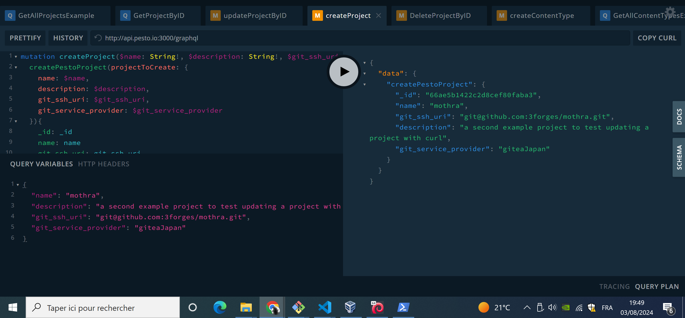
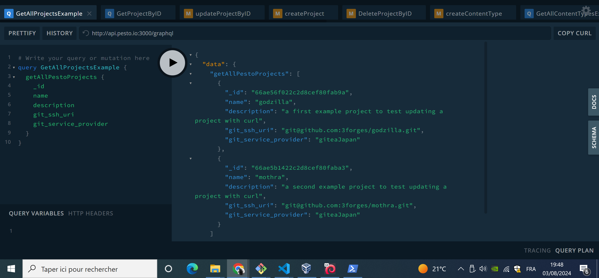
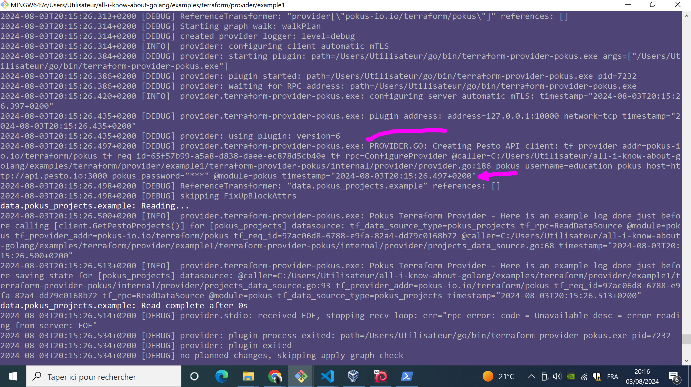
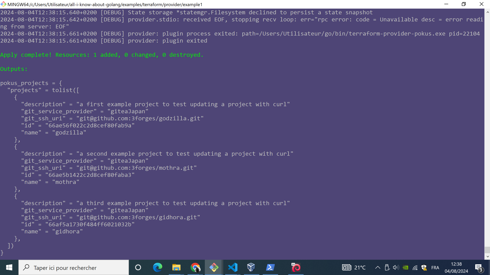
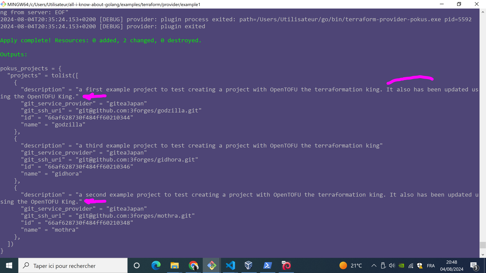
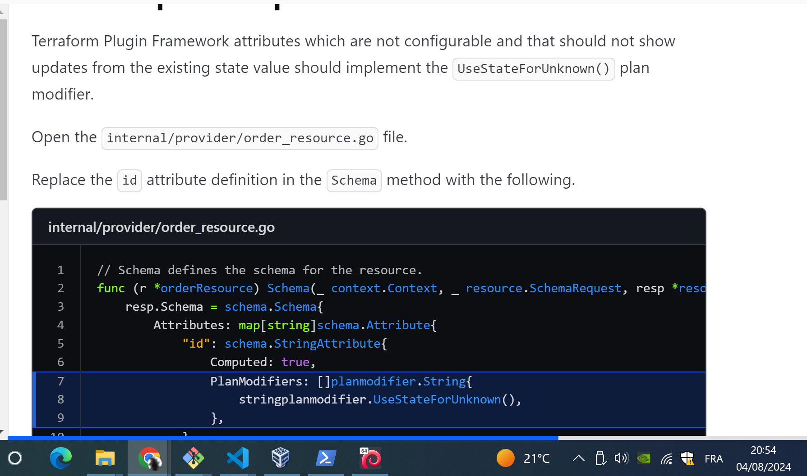
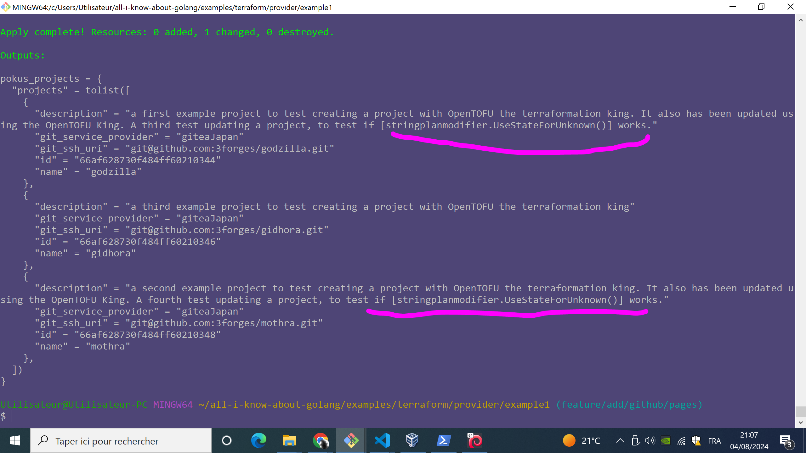

## First try: the official terraform tutorial

In this chapter, I will try and implement a tofu provider, using hashcorp's official <https://developer.hashicorp.com/terraform/tutorials/providers-plugin-framework/providers-plugin-framework-provider>

### Foreword

Note that the terraform provider implemented here, is implemented using the `SDKv2`, which is the "ancient" legacy framework that is stil maintained. That, because the scaffolding project, and the hashicorp docuementation are both based on that legacy ancient `SDKv2`.

A second version will use the more recent terraform plugins framework.

About those two version of frameworks, see <https://developer.hashicorp.com/terraform/plugin/framework-benefits>

### Step 0: spinup the project

* There:

```bash
git clone https://github.com/hashicorp/terraform-provider-scaffolding-framework ./terraform-provider-pokus

cd ./terraform-provider-pokus/

# ---
# then rename the go module
# go mod edit -module terraform-provider-hashicups
go mod edit -module terraform-provider-pokus

# ---
# Then, install all the provider's dependencies.
go mod tidy

```

Note there that at the date I write this, 03/08/2024, the <https://github.com/hashicorp/terraform-provider-scaffolding-framework> has no change of licence, like the new business license for hashicorp. It has a mozilla public license.

### Step 1: reset internal dependencies

Open the `main.go` file in the `terraform-provider-pokus` repository's root directory and replace the import declaration that you find :

```Golang
import (
 "context"
 "flag"
 "log"

 "github.com/hashicorp/terraform-plugin-framework/providerserver"
 "github.com/hashicorp/terraform-provider-scaffolding-framework/internal/provider"
)
```

with the following:

```Golang
import (
    "context"
    "flag"
    "log"

    "github.com/hashicorp/terraform-plugin-framework/providerserver"

    "terraform-provider-pokus/internal/provider"
)

```

### Step 2: get a rest api up and running

I will try with my own api available at :

* <http://api.pesto.io:3000/api>
* and as graphql <http://api.pesto.io:3000/graphql>

if I experience any issue, i can always use the "hashicups" rest api from the tutorial.

### Step 3: The most simple `provider.go` and `main.go`

Edit the `provider.go` and `main.go` files, with the below content:

* In `provider.go`:

```Golang
package provider

import (
    "context"

    "github.com/hashicorp/terraform-plugin-framework/datasource"
    "github.com/hashicorp/terraform-plugin-framework/provider"
    "github.com/hashicorp/terraform-plugin-framework/provider/schema"
    "github.com/hashicorp/terraform-plugin-framework/resource"
)

// Ensure the implementation satisfies the expected interfaces.
var (
    _ provider.Provider = &pokusProvider{}
)

// New is a helper function to simplify provider server and testing implementation.
func New(version string) func() provider.Provider {
    return func() provider.Provider {
        return &pokusProvider{
            version: version,
        }
    }
}

// pokusProvider is the provider implementation.
type pokusProvider struct {
    // version is set to the provider version on release, "dev" when the
    // provider is built and ran locally, and "test" when running acceptance
    // testing.
    version string
}

// Metadata returns the provider type name.
func (p *pokusProvider) Metadata(_ context.Context, _ provider.MetadataRequest, resp *provider.MetadataResponse) {
    resp.TypeName = "pokus"
    resp.Version = p.version
}

// Schema defines the provider-level schema for configuration data.
func (p *pokusProvider) Schema(_ context.Context, _ provider.SchemaRequest, resp *provider.SchemaResponse) {
    resp.Schema = schema.Schema{}
}

// Configure prepares a HashiCups API client for data sources and resources.
func (p *pokusProvider) Configure(ctx context.Context, req provider.ConfigureRequest, resp *provider.ConfigureResponse) {
}

// DataSources defines the data sources implemented in the provider.
func (p *pokusProvider) DataSources(_ context.Context) []func() datasource.DataSource {
    return nil
}

// Resources defines the resources implemented in the provider.
func (p *pokusProvider) Resources(_ context.Context) []func() resource.Resource {
    return nil
}

```

* In `main.go`

```Golang
// Copyright (c) HashiCorp, Inc.
// SPDX-License-Identifier: MPL-2.0

package main

import (
    "context"
    "flag"
    "log"

    "github.com/hashicorp/terraform-plugin-framework/providerserver"

    "terraform-provider-pokus/internal/provider"
)


// Run "go generate" to format example terraform files and generate the docs for the registry/website

// If you do not have terraform installed, you can remove the formatting command, but its suggested to
// ensure the documentation is formatted properly.
//go:generate terraform fmt -recursive ./examples/

// Run the docs generation tool, check its repository for more information on how it works and how docs
// can be customized.
//go:generate go run github.com/hashicorp/terraform-plugin-docs/cmd/tfplugindocs generate -provider-name scaffolding

var (
 // these will be set by the goreleaser configuration
 // to appropriate values for the compiled binary.
 version string = "dev"

 // goreleaser can pass other information to the main package, such as the specific commit
 // https://goreleaser.com/cookbooks/using-main.version/
)
func main() {
    var debug bool

    flag.BoolVar(&debug, "debug", false, "set to true to run the provider with support for debuggers like delve")
    flag.Parse()

    opts := providerserver.ServeOpts{
        // NOTE: This is not a typical Terraform Registry provider address,
        // such as registry.terraform.io/hashicorp/hashicups. This specific
        // provider address is used in these tutorials in conjunction with a
        // specific Terraform CLI configuration for manual development testing
        // of this provider.
        Address: "pokus-io.io/terraform/pokus",
        Debug:   debug,
    }

    err := providerserver.Serve(context.Background(), provider.New(version), opts)

    if err != nil {
        log.Fatal(err.Error())
    }
}

```

### Step 4: Prepare the `Tofu` dev env

Cd into the `./examples/terraform/provider/example1/` folder of this repo.

#### Windows

##### Point 1: Prepare the `terraform.rc`

* In git bash for windows, run:

```bash
export TF_RC_FILE_PATH=$(echo $APPDATA | sed 's#\\#/#g' | sed 's#C:#/c#g')/terraform.rc
echo "  TF_RC_FILE_PATH=[${TF_RC_FILE_PATH}]"

export MY_GO_BIN_FOLDER=$(go env GOBIN)
export MY_DEFAULT_GO_BIN_FOLDER=$(echo "$HOME/go/bin" | sed 's#/c##')

if [ "x${MY_GO_BIN_FOLDER}" == "x" ]; then
  echo "GO BIN is empty, so will use default"
  export PATH_FOR_DEV_OVERRIDES="${MY_DEFAULT_GO_BIN_FOLDER}"
else
  echo "GO BIN is not empty"
  export PATH_FOR_DEV_OVERRIDES="${MY_DEFAULT_GO_BIN_FOLDER}"
fi;


echo "  PATH_FOR_DEV_OVERRIDES=[${PATH_FOR_DEV_OVERRIDES}]"


cat <<EOF >${TF_RC_FILE_PATH}
provider_installation {

  dev_overrides {
      # "pokus-io.io/terraform/pokus" = "<PATH>"
      "pokus-io.io/terraform/pokus" = "${PATH_FOR_DEV_OVERRIDES}"
      }

  # For all other providers, install them directly from their origin provider
  # registries as normal. If you omit this, Terraform will _only_ use
  # the dev_overrides block, and so no other providers will be available.
  direct {}
}

EOF
```

Above, the `pokus-io.io/terraform/pokus` must match the value set in this block, in the `main.go` of your provider:

```Golang
    opts := providerserver.ServeOpts{
        // NOTE: This is not a typical Terraform Registry provider address,
        // such as registry.terraform.io/hashicorp/hashicups. This specific
        // provider address is used in these tutorials in conjunction with a
        // specific Terraform CLI configuration for manual development testing
        // of this provider.
        Address: "pokus-io.io/terraform/pokus",
        Debug:   debug,
    }
```

##### Point 2: go install your provider

To make our developed terraform provider, in the GOBIN folder, go to the `vvvv` folder, and run, either in powershell or git bash for windows :

```bash
go install .
```

##### Point 3: run a TOFU/terraform recipe using the pokus provider

Now, we are ready to start running TOFU/terraform recipe.

Cd into the `./examples/terraform/provider/example1/` folder of this repo, and create a `main.tf` file with the below content:

```Terraform
terraform {
  required_providers {
    pokus = {
      source = "pokus-io.io/terraform/pokus"
    }
  }
}

provider "pokus" {}

data "pokus_coffees" "example" {}
```

ANd in powershell, in the same folder, run:

```Powershell
$env:TF_LOG = "debug"

tofu init

tofu validate
tofu fmt

tofu plan

```

What tells us that the setup is successful, is that the DEBUG logs will confirm the pokus terraform plugin is running, and an error is thrown telling that the `pokus_coffees` datasource does not exist, which makes sense, as far as of now, we did not define any datasource of name `pokus_coffees` in our code:

```bash
2024-08-03T13:09:43.313+0200 [DEBUG] provider: using plugin: version=6
2024-08-03T13:09:43.373+0200 [ERROR] vertex "data.pokus_coffees.example" error: Invalid data source
╷
│ Error: Invalid data source
│
│   on main.tf line 11, in data "pokus_coffees" "example":
│   11: data "pokus_coffees" "example" {}
│
│ The provider pokus-io.io/terraform/pokus does not support data source "pokus_coffees".
╵
2024-08-03T13:09:43.381+0200 [DEBUG] provider.stdio: received EOF, stopping recv loop: err="rpc error: code = Unavailable desc = error reading from server: EOF"
```

### Step 5: Configure the client of the provider

The client is what is going to connect to my REST API.
It will hold the hostname, port num, URL to the REST API, and if necessary the auth credentials.

All the code of that client will be in the `provider.go` source code file.

The client's design is simple:

> The provider uses the `Configure` method to read API client configuration values from the Terraform configuration or environment variables. After verifying the values should be acceptable, the API client is created and made available for data source and resource usage.

The configure method follows these steps:

* **Retrieves values from the configuration**. The method will attempt to retrieve values from the provider configuration and convert it to an providerModel struct.
* **Checks for unknown configuration values**. The method prevents an unexpectedly misconfigured client, if Terraform configuration values are only known after another resource is applied.
* **Retrieves values from environment variables**. The method retrieves values from environment variables, then overrides them with any set Terraform configuration values.
* **Creates API client**. The method invokes the HashiCups API client's NewClient function.
* **Stores configured client for data source and resource usage**. The method sets the DataSourceData and ResourceData fields of the response, so the client is available for usage by data source and resource implementations.

The code presented by the hashicorp tutorial suggests to use an external go client able to hit the targetted rest API.

I created a go client for the pesto-api, <https://github.com:3forges/pesto-api-client-go> (fully inspired by the <https://github.com/hashicorp-demoapp/hashicups-client-go>), and will use that Go client in the implementation of my teraform pokus provider, which will be able to CRUD Pesto API _project_ resources.

And I run in the `./examples/terraform/provider/example1/terraform-provider-pokus` folder, I run :

```bash
go get github.com/3forges/pesto-api-client-go

```

Then I edit my `provider.go` to add the **`Configure`** function (and VERY IMPORTANT, the schame function needs to be updated as well, addtionnally to the new `pokusProviderModel` `struct`) :

```Golang

// Schema defines the provider-level schema for configuration data.
func (p *pokusProvider) Schema(_ context.Context, _ provider.SchemaRequest, resp *provider.SchemaResponse) {
 resp.Schema = schema.Schema{
  Attributes: map[string]schema.Attribute{
   "host": schema.StringAttribute{
    Optional: true,
   },
   "username": schema.StringAttribute{
    Optional: true,
   },
   "password": schema.StringAttribute{
    Optional:  true,
    Sensitive: true,
   },
  },
 }
}


//////////////////////////////////////////////
//////////////////////////////////////////////
//////////////////////////////////////////////
//// BEGIN CONFIGURE PART
//////////////////////////////////////////////
//////////////////////////////////////////////
//////////////////////////////////////////////

// // Configure prepares a Pesto API client for data sources and resources.
// func (p *pokusProvider) Configure(ctx context.Context, req provider.ConfigureRequest, resp *provider.ConfigureResponse) {
// }
// pokusProviderModel maps provider schema data to a Go type.
type pokusProviderModel struct {
 Host     types.String `tfsdk:"host"`
 Username types.String `tfsdk:"username"`
 Password types.String `tfsdk:"password"`
}

func (p *pokusProvider) Configure(ctx context.Context, req provider.ConfigureRequest, resp *provider.ConfigureResponse) {
    // Retrieve provider data from configuration
    var config pokusProviderModel
    diags := req.Config.Get(ctx, &config)
    resp.Diagnostics.Append(diags...)
 
    if resp.Diagnostics.HasError() {
        return
    }

    // If practitioner provided a configuration value for any of the
    // attributes, it must be a known value.

    if config.Host.IsUnknown() {
        resp.Diagnostics.AddAttributeError(
            path.Root("host"),
            "Unknown HashiCups API Host",
            "The provider cannot create the HashiCups API client as there is an unknown configuration value for the HashiCups API host. "+
                "Either target apply the source of the value first, set the value statically in the configuration, or use the POKUS_HOST environment variable.",
        )
    }

    if config.Username.IsUnknown() {
        resp.Diagnostics.AddAttributeError(
            path.Root("username"),
            "Unknown HashiCups API Username",
            "The provider cannot create the HashiCups API client as there is an unknown configuration value for the HashiCups API username. "+
                "Either target apply the source of the value first, set the value statically in the configuration, or use the POKUS_USERNAME environment variable.",
        )
    }

    if config.Password.IsUnknown() {
        resp.Diagnostics.AddAttributeError(
            path.Root("password"),
            "Unknown HashiCups API Password",
            "The provider cannot create the HashiCups API client as there is an unknown configuration value for the HashiCups API password. "+
                "Either target apply the source of the value first, set the value statically in the configuration, or use the POKUS_PASSWORD environment variable.",
        )
    }

    if resp.Diagnostics.HasError() {
        return
    }

    // Default values to environment variables, but override
    // with Terraform configuration value if set.

    host := os.Getenv("POKUS_HOST")
    username := os.Getenv("POKUS_USERNAME")
    password := os.Getenv("POKUS_PASSWORD")

    if !config.Host.IsNull() {
        host = config.Host.ValueString()
    }

    if !config.Username.IsNull() {
        username = config.Username.ValueString()
    }

    if !config.Password.IsNull() {
        password = config.Password.ValueString()
    }

    // If any of the expected configurations are missing, return
    // errors with provider-specific guidance.

    if host == "" {
        resp.Diagnostics.AddAttributeError(
            path.Root("host"),
            "Missing HashiCups API Host",
            "The provider cannot create the HashiCups API client as there is a missing or empty value for the HashiCups API host. "+
                "Set the host value in the configuration or use the POKUS_HOST environment variable. "+
                "If either is already set, ensure the value is not empty.",
        )
    }

    if username == "" {
        resp.Diagnostics.AddAttributeError(
            path.Root("username"),
            "Missing HashiCups API Username",
            "The provider cannot create the HashiCups API client as there is a missing or empty value for the HashiCups API username. "+
                "Set the username value in the configuration or use the POKUS_USERNAME environment variable. "+
                "If either is already set, ensure the value is not empty.",
        )
    }

    if password == "" {
        resp.Diagnostics.AddAttributeError(
            path.Root("password"),
            "Missing HashiCups API Password",
            "The provider cannot create the HashiCups API client as there is a missing or empty value for the HashiCups API password. "+
                "Set the password value in the configuration or use the POKUS_PASSWORD environment variable. "+
                "If either is already set, ensure the value is not empty.",
        )
    }

    if resp.Diagnostics.HasError() {
        return
    }

    // Create a new PestoAPI client using the configuration values
    client, err := pesto.NewClient(&host, &username, &password)
    if err != nil {
        resp.Diagnostics.AddError(
            "Unable to Create HashiCups API Client",
            "An unexpected error occurred when creating the HashiCups API client. "+
                "If the error is not clear, please contact the provider developers.\n\n"+
                "HashiCups Client Error: "+err.Error(),
        )
        return
    }

    // Make the HashiCups client available during DataSource and Resource
    // type Configure methods.
    resp.DataSourceData = client
    resp.ResourceData = client
}

//////////////////////////////////////////////
//////////////////////////////////////////////
//////////////////////////////////////////////
//// END CONFIGURE PART
//////////////////////////////////////////////
//////////////////////////////////////////////
//////////////////////////////////////////////


```

Then, I added a new datasource, by adding its definition in a new go source file `internal/provider/projects_data_source.go`, with the following content:

```Golang
package provider

import (
    "context"

    "github.com/hashicorp/terraform-plugin-framework/datasource"
    "github.com/hashicorp/terraform-plugin-framework/datasource/schema"
)

// Ensure the implementation satisfies the expected interfaces.
var (
 _ datasource.DataSource = &projectsDataSource{}
  )

// NewProjectsDataSource is a helper function to simplify the provider implementation.
func NewProjectsDataSource() datasource.DataSource {
    return &projectsDataSource{}
}

// projectsDataSource is the data source implementation.
type projectsDataSource struct{}

// Metadata returns the data source type name.
func (d *projectsDataSource) Metadata(_ context.Context, req datasource.MetadataRequest, resp *datasource.MetadataResponse) {
    resp.TypeName = req.ProviderTypeName + "_projects"
}

// Schema defines the schema for the data source.
func (d *projectsDataSource) Schema(_ context.Context, _ datasource.SchemaRequest, resp *datasource.SchemaResponse) {
    resp.Schema = schema.Schema{}
}

// Read refreshes the Terraform state with the latest data
func (d *projectsDataSource) Read(ctx context.Context, req datasource.ReadRequest, resp *datasource.ReadResponse) {
}
```

And adding the reference to that new datasource in the `internal/provider/provider.go`, like this:

```Golang
// DataSources defines the data sources implemented in the provider.
func (p *pokusProvider) DataSources(_ context.Context) []func() datasource.DataSource {
    return []func() datasource.DataSource {
        NewProjectsDataSource,
    }
}
```

then run the `tofu`:

```Powershell
$env:POKUS_HOST = "http://api.pesto.io:3000"
$env:POKUS_USERNAME = "education"
$env:POKUS_PASSWORD = "test123"
tofu plan

```

```Powershell
export POKUS_HOST="http://api.pesto.io:3000"
export POKUS_USERNAME="education"
export POKUS_PASSWORD="test123"
tofu plan
terraform apply -auto-approve
```

Note that then, I get an error with the HTTP call to the pesto API: a 404 of course, because my API has no authentication endpoint.

I will have to fix that, one way, or another (is it possible to implement a terraform provider without authentication? )

Response: Yes! The authenticationwas made mandatory only in the go client of the REST API, with the signin method, I just commented it and it all worked, the GET Http call to the API successfully fetched the pesto-projects!

Actually not, the go client is just created: the datasource alone, even with a terraform output, does not fetch the api, it obviously is based only on the terraform state.

before getting to next step, note that instead of using environment variables, the host, user and password configuration parameters can be set in the providers configuration like this:

```Terraform
terraform {
  required_providers {
    pokus = {
      source = "pokus-io.io/terraform/pokus"
    }
  }
}

provider "pokus" {
    // host = "http://api.pesto.io:3000"
    // username = "education"
    // password = "sdsddg"
  host     = "http://api.pesto.io:3000"
  username = "education"
  password = "test123"
}

```

### Step 6: Complete the first Datasource

In the previous step, to be able to test running the tofu terraformation, we added a first "dummy" datasource:

* That datasource was qualified dummy, because it didn't fetch any data from the rest API, as we run `tofu apply`.
* We will now complete the implementation of that data source, to fix that.
* note that i used version v0.0.3 of the [`pesto-api-client-go`](https://github.com/3forges/pesto-api-client-go).

I only changed the source code, of the `./internal/provider/projects_data_source.go` file, to be :

```Golang
package pesto

import (
 "encoding/json"
 "fmt"
 "net/http"
 "strings"
)

// GetPestoProjects - Returns list of PestoProjects (no auth required)
func (c *Client) GetPestoProjects() ([]PestoProject, error) {
 req, err := http.NewRequest("GET", fmt.Sprintf("%s/pesto-project", c.HostURL), nil)
 if err != nil {
  return nil, err
 }

 body, err := c.doRequest(req, nil)
 if err != nil {
  return nil, err
 }

 PestoProjects := []PestoProject{}
 err = json.Unmarshal(body, &PestoProjects)
 if err != nil {
  return nil, err
 }

 return PestoProjects, nil
}

// GetPestoProject - Returns specific PestoProject (no auth required)
func (c *Client) GetPestoProject(PestoProjectID string) ([]PestoProject, error) {
 req, err := http.NewRequest("GET", fmt.Sprintf("%s/pesto-project/%s", c.HostURL, PestoProjectID), nil)
 if err != nil {
  return nil, err
 }

 body, err := c.doRequest(req, nil)
 if err != nil {
  return nil, err
 }

 PestoProjects := []PestoProject{}
 err = json.Unmarshal(body, &PestoProjects)
 if err != nil {
  return nil, err
 }

 return PestoProjects, nil
}

/*
// GetPestoProjectIngredients - Returns list of PestoProject ingredients (no auth required)
func (c *Client) GetPestoProjectIngredients(PestoProjectID string) ([]Ingredient, error) {
 req, err := http.NewRequest("GET", fmt.Sprintf("%s/PestoProjects/%s/ingredients", c.HostURL, PestoProjectID), nil)
 if err != nil {
  return nil, err
 }

 body, err := c.doRequest(req, nil)
 if err != nil {
  return nil, err
 }

 ingredients := []Ingredient{}
 err = json.Unmarshal(body, &ingredients)
 if err != nil {
  return nil, err
 }

 return ingredients, nil
}

*/
// CreatePestoProject - Create new PestoProject
func (c *Client) CreatePestoProject(project PestoProject, authToken *string) (*PestoProject, error) {
 rb, err := json.Marshal(project)
 if err != nil {
  return nil, err
 }

 req, err := http.NewRequest("POST", fmt.Sprintf("%s/pesto-project", c.HostURL), strings.NewReader(string(rb)))
 if err != nil {
  return nil, err
 }

 body, err := c.doRequest(req, authToken)
 if err != nil {
  return nil, err
 }

 newPestoProject := PestoProject{}
 err = json.Unmarshal(body, &newPestoProject)
 if err != nil {
  return nil, err
 }
 return &newPestoProject, nil
}

```

And then:

* I created 2 pesto projects using the graphQL Appolo client to hit the pesto api:





* I ran again the `tofu apply`, and here was the awesome result:


I here note the following caveats:

* my only issues were about the ID field of the Project entity of the Pesto API
* I learned that :
  * The ID field defined in the `type projectsModel struct`, `ID  types.String 'tfsdk:"id"'`, must match the ID field defined in the `Schema` function, `"id": schema.StringAttribute{`.
  * both of those must comply with these rules:
    * The string value on the right of `ID  types.String 'tfsdk:"id"'`, must not start with an underscore character, and must contain only lowercase characters.
    * The string value on the right of `"id": schema.StringAttribute{`, must not start with an underscore character, and must contain only lowercase characters.

### Step 7: Implement logging

TOCOMPLETE <https://developer.hashicorp.com/terraform/tutorials/providers-plugin-framework/providers-plugin-framework-logging>

It's very easy, basically you add in imported packages `"github.com/hashicorp/terraform-plugin-log/tflog"`

And then you can use:

```Golang

// Read refreshes the Terraform state with the latest data
func (d *projectsDataSource) Read(ctx context.Context, req datasource.ReadRequest, resp *datasource.ReadResponse) {
 var state projectsDataSourceModel
 tflog.Info(ctx, "Pokus Terraform Provider - Here is an example log done just before calling [client.GetPestoProjects()] for [pokus_projects] datasource")
 // [...]
}
```

To see those logs, you would still have to set log level to INFO, e.g. with `export TF_LOG="INFO"`.

There are more advanced features to `tflog`, like structured logs, log filtering, and masking secret values, like this, in the `internal/provider/provider.go` source code file:

```Golang
func (p *pokusProvider) Configure(ctx context.Context, req provider.ConfigureRequest, resp *provider.ConfigureResponse) {
 // Retrieve provider data from configuration
 var config pokusProviderModel

    /// [...]

 if resp.Diagnostics.HasError() {
  return
 }
    ctx = tflog.SetField(ctx, "pokus_host", host)
    ctx = tflog.SetField(ctx, "pokus_username", username)
    ctx = tflog.SetField(ctx, "pokus_password", password)
    ctx = tflog.MaskFieldValuesWithFieldKeys(ctx, "pokus_password")

    tflog.Debug(ctx, "Creating Pesto API client")

    /// [...]

}
```

Example result :



### Step 8: Create and read resources

* <https://developer.hashicorp.com/terraform/tutorials/providers-plugin-framework/providers-plugin-framework-resource-create>

TODO: complete full exaplanation descriotion of source code changes.

After I added the source code `project_resource.go`, of the `pokus_project` new resource:

* Note I had to change a lot the source code of the example given if the tutorial, which is really complicated, I think they should give a simple example, and a more complex one, for the developers to understand much better and easier. This means that for the TOFU project, there is a real big need of improving documentation and communication to developers.
* I had to change my Pesto API:
  * so that when creating a project, the API returns the created project,
  * AND, such that the http answer status code is 201 (Created), instead if 204 (No content)
* I also had to change the API golang client, such that it does not throw an error when the API returns a 201 (Created) HTTP response code, which was the case for the [_"hashicups"_ go client](https://github.com/hashicorp-demoapp/hashicups-client-go/blob/1df90c457bd4ad404c5b6ab20dfb1856c7ded558/client.go#L74)
* All in all, some things were absolutely mandatory to fix/adjut all those aspects in all 3 compoents (the API/the go client/ and the tofu terraformation provider):
  * adding lots of Debug level logs with tflog was extremely important, but not even enough
  * I also had, to add debug logs in the code of my Pesto API, and to run curl tests to verify for sure, that my API indeed returned the JSON it had to return to my tofu terraformation provider.
  * A third point was a remained unsolved question: I could not at all get any logs from the go client, when runnging `tofu apply` tests. How to do that could be solved by adding logging to a file on the filesystem I think, bu thtat is really not handy, I would like to find another method, and this point has to be worked on, to industrialize writing tofu terraformation providers.

Finally, Here is the beautiful result I got, as all was fixed:



Its' so beautiful.

**Worth noting** - In my `tofu` terraformation code, I created a dependency between the `pokus_projects` **datasource**, and the 3 `pokus_project` **resources**, to make sure that the datasource is fetched from REST API only after the resources are created in the rest api:

* In `main.tf`:

```Tf
resource "pokus_project" "godzilla_project" {
  name                 = "godzilla"
  description          = "a first example project to test creating a project with OpenTOFU the terraformation king"
  git_service_provider = "giteaJapan"
  git_ssh_uri          = "git@github.com:3forges/godzilla.git"
}

resource "pokus_project" "mothra_project" {
  name                 = "mothra"
  description          = "a second example project to test creating a project with OpenTOFU the terraformation king"
  git_service_provider = "giteaJapan"
  git_ssh_uri          = "git@github.com:3forges/mothra.git"

}

resource "pokus_project" "gidhora_project" {
  name                 = "gidhora"
  description          = "a third example project to test creating a project with OpenTOFU the terraformation king"
  git_service_provider = "giteaJapan"
  git_ssh_uri          = "git@github.com:3forges/gidhora.git"
}
```

* In `datasource.tf`:

```Tf
data "pokus_projects" "example2" {
  depends_on = [
    pokus_project.godzilla_project,
    pokus_project.mothra_project,
    pokus_project.gidhora_project,
  ]
}

```

### Step 9: Update resources

* <https://developer.hashicorp.com/terraform/tutorials/providers-plugin-framework/providers-plugin-framework-resource-update>

Oh my gosh, this one was really crazy to find: Not so hard to find, in only 2 hours I found the issue, because I know very well my API, but here is what happened:

* First, As I strictly follow the source code like is shown in the official tutorial, the big problem is that the API kept answering that the ID in the request was empty
* I cehcked with logs and it was indeed the case: So I seached why
* Well its simple and makes so much sense: in the `plan`, you only have the properties that are mentioned in the `*.tf` file. And well I did not write the ID in the `*.tf` file, because if the the auto generated primary key in the API database. 
* Yet, my model does include the ID, and the API returns the object ID which is created, modified, or updated.
* So well in the golang code, the ID was NOT there, it could not be there, since it is not in the `*.tf` file.
* And therefore, in the golang code:
  * I retrieve all the properties of the resoruces, to update them, **from the plan**
  * But I retireve the reource ID (the ID of the Pesto Project) **from the state, NOT from the plan**.

And there it all worked, and I ended up with the following update method, which is the only thing I had to add in my source code (in `internal/provider/project_resource.go`), to add the update feature:

```Golang
// Update updates the resource and sets the updated Terraform state on success.
func (r *projectResource) Update(ctx context.Context, req resource.UpdateRequest, resp *resource.UpdateResponse) {
 //func (r *orderResource) Update(ctx context.Context, req resource.UpdateRequest, resp *resource.UpdateResponse) {
 // Retrieve values to update from plan (not state)
 var plan projectResourceModel
 diags := req.Plan.Get(ctx, &plan)
 resp.Diagnostics.Append(diags...)
 if resp.Diagnostics.HasError() {
  return
 }

 // retireve project ID from state (not plan)
 var state projectResourceModel
 stateDiags := req.State.Get(ctx, &state)
 resp.Diagnostics.Append(stateDiags...)

 if resp.Diagnostics.HasError() {
  return
 }

 // Generate API request body from plan

 apiRequestBody := pesto.UpdatePestoProjectPayload{
  // ID:                   plan.ID.ValueString(),
  ID:                   state.ID.ValueString(),
  Name:                 plan.Name.ValueString(),
  Description:          plan.Description.ValueString(),
  Git_ssh_uri:          plan.Git_ssh_uri.ValueString(),
  Git_service_provider: plan.Git_service_provider.ValueString(),
 }

 tflog.Info(ctx, fmt.Sprintf("PROJECT RESOURCE - UPDATE - Updating pesto project of (plan.)ID : %v \n", plan.ID.ValueString()))
 tflog.Info(ctx, fmt.Sprintf("PROJECT RESOURCE - UPDATE - Updating pesto project of (state.)ID : %v \n", state.ID.ValueString()))
 tflog.Info(ctx, fmt.Sprintf("PROJECT RESOURCE - UPDATE - Updating pesto project of (plan.)name : %v \n", plan.Name))
 tflog.Info(ctx, fmt.Sprintf("PROJECT RESOURCE - UPDATE - Updating pesto project of (apiRequestBody.)ID : %v \n", apiRequestBody.ID))
 tflog.Info(ctx, fmt.Sprintf("PROJECT RESOURCE - UPDATE - Updating pesto project of (apiRequestBody.)Name : %v \n", apiRequestBody.Name))
 tflog.Info(ctx, fmt.Sprintf("PROJECT RESOURCE - UPDATE - Updating pesto project of (apiRequestBody.)Git_ssh_uri : %v \n", apiRequestBody.Git_ssh_uri))
 tflog.Info(ctx, fmt.Sprintf("PROJECT RESOURCE - UPDATE - Updating pesto project of (apiRequestBody.)Description : %v \n", apiRequestBody.Description))

 tflog.Info(ctx, fmt.Sprintf("PROJECT RESOURCE - UPDATE - Updating pesto project with payload : %v \n", apiRequestBody))
 // Update existing Pesto Project
 project, err := r.client.UpdatePestoProject(ctx, apiRequestBody, nil)

 tflog.Debug(ctx, fmt.Sprintf("PROJECT RESOURCE - UPDATE - here is the tfsdk response object: %v", resp))
 tflog.Debug(ctx, fmt.Sprintf("PROJECT RESOURCE - UPDATE - here is the project returned from Pesto API: %v", project))

 var isUpdatedProjectNil string

 if project != nil {
  isUpdatedProjectNil = "NO updated pesto project object is not NIL"
 } else {
  isUpdatedProjectNil = "YES updated pesto project object is NIL!"
 }
 tflog.Debug(ctx, fmt.Sprintf("PROJECT RESOURCE - UPDATE - Is the updated project returned from Pesto API NIL ?: %v", isUpdatedProjectNil))

 // _, err := r.client.UpdatePestoProject(plan.ID.ValueString(), hashicupsItems)
 if err != nil {
  resp.Diagnostics.AddError(
   "Error Updating Pesto Project",
   "Could not update order, unexpected error: "+err.Error(),
  )
  return
 }
 tflog.Info(ctx, fmt.Sprintf("PROJECT RESOURCE - UPDATE - Successfully updated pesto project of name : %v \n", project.Name))

 // Update resource state with the Pesto Project returned by the API (mybe that one is not necessary ? I'm not sure, yet)
 plan.ID = types.StringValue(plan.ID.ValueString())
 plan = projectResourceModel{
  ID:                   types.StringValue(project.ID),
  Name:                 types.StringValue(project.Name),
  Description:          types.StringValue(project.Description),
  Git_ssh_uri:          types.StringValue(project.Git_ssh_uri),
  Git_service_provider: types.StringValue(project.Git_service_provider),
 }
 // Update resource state with updated sub-object if
 // there are some, because sub-objects are not populated.
 // -----------------------
 // /!\ /!\ /!\ SO HERE: THIS WOULD MEAN THAT
 // PESTO API WILL NEED AN ENDPOINT TO
 // RETRIEVE ALL CONTENT TYPES FROM THEIR
 // PROJECT ID  (a foreing key in the database of the Pesto API)
 // -----------------------
 // - this would also mean that we expect
 //   that a pesto project has a [content_types] List property,
 //   that allow creating and updating the content types of a given Pesto Project
 // >> I have reason to dislike that design
 // >> Why ?
 // >> Because I want that a single content-type entity can be reused in several pesto project,
 // >> so I would have to modify the Pesto API so that a the Content Type Entity has a [project_ids] property, that is an array (or a set) of project IDs.
 // >> that would mean having an (N <-> N) relation between Pesto Projects and Pesto Content Types.
 // >> ---
 // >> Yet, having an (N <-> N) relation between
 // >> Pesto Projects and Pesto Content Types, is
 // >> a bit too high a complexity to my taste, and
 // >> since we are talking about an
 // >> end user feature, I can think of another design
 // >> to bring that same reusability for end user:
 // >>
 // >> Using the App GUI, The user can "import" a
 // >> content type, from one project, to another,
 // >> which is easy to implement only in the GUI
 // >> presentation layer, and on the API side, it
 // >> only requires and API endpoint import(contentType PestoContentType, destinationProject PestoProject)
 // >> ---
 // >> And at the terraform level, the
 // >> "pokus_projects" datasource Read method
 // >> allows to fetch all the content-types of
 // >> a given project, using the API endpoint to
 // >> fetch all PestoContentTypes of
 // >> a given PestoProject's ID
 // >>
 // >>
 // -----------------------
 // >>
 // >> So we won't add this for
 // >> the Pokus Pesto Provider, yet, if
 // >> we did, it would look like this:
 // -----------------------

 /*
  retrievedPestoContentTypes, err := r.client.GetPestoContentTypes(plan.ID.ValueString())
  if err != nil {
   resp.Diagnostics.AddError(
    "Error Fetching Pesto Content Types",
    "Could not read Pesto Content Types for Pesto Project ID "+plan.ID.ValueString()+": "+err.Error(),
   )
   return
  }
 */

 // Update resource state with updated Pesto Content Types
 // -
 // In [projectResourceModel] you would
 // have a [PestoContentTypes] Field, lke you seee commented above.
 // -
 // Also a pestoContentTypeModel struct would be defined, like the one you can see in this source file, commented.
 // And also the resource Schema would have a Nested List like the one you can see in this source file, commented.

 /*
  plan.PestoContentTypes = []pestoContentTypeModel{}

  for _, contentTypeItem := range retrievedPestoContentTypes {
   plan.PestoContentTypes = append(plan.PestoContentTypes, pestoContentTypeModel{
    ID:                     types.StringValue(contentTypeItem.ID),
    Project_id:             types.StringValue(contentTypeItem.Name),
    Name:                   types.StringValue(contentTypeItem.Teaser),
    Frontmatter_definition: types.StringValue(contentTypeItem.Description),
    Description:            types.StringValue(contentTypeItem.Price),
   })
  }
 */
 // And finally update last updated timestamp
 plan.LastUpdated = types.StringValue(time.Now().Format(time.RFC850))

 // -
 diags = resp.State.Set(ctx, plan)
 resp.Diagnostics.Append(diags...)
 if resp.Diagnostics.HasError() {
  return
 }
}

```

Et voilà!

Awesome result (note in the below test i only changed the description of godzilla and mothra):




A few minutes later, after I completed the work above described, which perfectly works, I then learned a big lesson, that there exist, for the problem I above describe, the _Use State For Unknown_ concept:



It makes so much sense of course!

That's how you actually learn: you ananlyze deeply a problem, find yoru own fix which makes sense, and then you find out there is a concept in the framework, which brings a neater, more graceful way to solve the same problem!

I tried that, and it beautifully works, awesome, I do not ned to explicitly access the state anymore in the Update method, neattt, see the neat result below, where I ran two more update tets on godzilla and mothra projects again:



